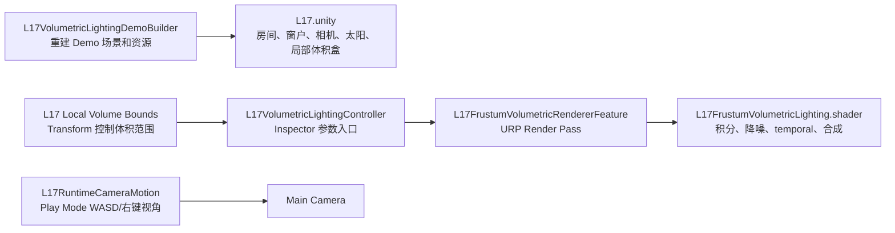

# L17 现代体积光制作流程

## 目标

在 `Assets/L17 Volumetric Lighting` 中制作一个 Unity URP 现代体积光技术 Demo。效果目标是展示真实场景里常见的“太阳光穿过窗户、墙体和遮挡物后，在室内空气中形成光束”的体积散射效果。

本示例不使用手摆 cube 光束，也不使用简单屏幕径向模糊 `god rays`。当前实现采用 URP `ScriptableRendererFeature`，在渲染管线中做低分辨率体积积分、阴影约束、temporal accumulation、双边上采样和 Bloom / ACES 前合成。

## 当前状态

- 场景：`Assets/L17 Volumetric Lighting/L17.unity`
- 渲染入口：`L17FrustumVolumetricRendererFeature`
- 渲染阶段：`BeforeRenderingPostProcessing`
- 体积范围：由场景对象 `L17 Local Volume Bounds` 的 Transform 控制
- 默认质量：半分辨率体积 buffer，`96 depth steps`
- 主光：URP Directional Light + Main Light Shadow Map
- 稳定性：blue-noise jitter、temporal accumulation、低分辨率 5 点十字双边降噪、全分辨率 3x3 双边上采样
- 合成：Bloom / ACES Tonemapping 前合成
- 运行镜头：`WASD` 移动，右键旋转视角，`Shift` 加速，`Q/E` 垂直移动
- 场景内容：简化房间、窗户、窗框、两个室内接光物、局部体积盒、太阳光、相机和后处理 Volume
- 场景管理：几何模型统一收纳到 `L17 Room Geometry` 下；功能对象保留在根级
- 跨场景行为：Renderer Data 中可以保持 L17 RendererFeature 开启；只有当前场景存在启用的 `L17VolumetricLightingController` 时才会渲染 L17 体积光
- 参数来源：Render pass 每帧从当前 Camera 所在 Scene 的 Controller 引用读取参数，避免不同场景通过共享 RendererFeature settings 互相污染
- 表面材质：`L17TwoSidedInteriorLit` 保持原 shader 名称，内部升级为双面 URP PBR，并提供 Meta pass 支持 Lighting 面板烘焙间接光

## 主要资源

| 类型 | 路径 |
| --- | --- |
| 场景 | `Assets/L17 Volumetric Lighting/L17.unity` |
| RendererFeature | `Assets/L17 Volumetric Lighting/Scripts/L17FrustumVolumetricRendererFeature.cs` |
| 参数控制器 | `Assets/L17 Volumetric Lighting/Scripts/L17VolumetricLightingController.cs` |
| 运行时相机 | `Assets/L17 Volumetric Lighting/Scripts/L17RuntimeCameraMotion.cs` |
| 体积盒可视化 | `Assets/L17 Volumetric Lighting/Scripts/L17LocalVolumeBoundsGizmo.cs` |
| 体积光 Shader | `Assets/L17 Volumetric Lighting/Shaders/L17FrustumVolumetricLighting.shader` |
| 场景表面 Shader | `Assets/L17 Volumetric Lighting/Shaders/L17TwoSidedInteriorLit.shader` |
| 蓝噪声贴图 | `Assets/L17 Volumetric Lighting/Textures/L17_BlueNoise64.asset` |
| 统一场景材质 | `Assets/L17 Volumetric Lighting/Materials/L17_RoomWall.mat` |
| 后处理 Profile | `Assets/L17 Volumetric Lighting/Materials/L17_PostProcessProfile.asset` |
| 构建器 | `Assets/L17 Volumetric Lighting/Editor/L17VolumetricLightingDemoBuilder.cs` |

## Unity 菜单

| 菜单 | 用途 |
| --- | --- |
| `Tools/Volumetric Lighting/Build L17 Modern Window Shafts Demo` | 重建 L17 场景、材质、RendererFeature、体积盒、相机、灯光、后处理和默认参数 |

## 制作流程

### 1. 搭建独立 L17 结构

在 `Assets/L17 Volumetric Lighting` 下建立独立资源结构：

- `Scripts`
- `Shaders`
- `Materials`
- `Textures`
- `Editor`
- `Docs`

核心思路是让 L17 自成一个可重建 Demo，不依赖其他 L 章节场景状态。`L17VolumetricLightingDemoBuilder.cs` 负责创建目录、材质、体积光 RendererFeature、场景对象和默认参数。

### 2. 第一版目标：从 cube 光束改为现代体积光

早期思路是避免围绕手摆 cube 光束继续修补，直接重做 L17：

- 使用 URP `ScriptableRendererFeature` 接入渲染管线。
- 用低分辨率 froxel / integrated buffer 表示相机视锥内的参与介质。
- 用 depth、shadow map 和 sun direction 在体积积分中决定散射与遮挡。
- 沿相机 Z 方向积分 transmittance / in-scattering。
- 用 blue noise jitter 和 temporal reprojection 降低步进噪声。
- 双边上采样到全屏，并在 Bloom / Tonemapping 前合成。

这一版确立了 L17 的方向：体积光应该由真实窗框、墙体、树叶等遮挡物的阴影切出来，而不是用可见 cube 模型摆出光束形状。

### 3. 第二版：接入 URP RendererFeature 管线

第二版实现核心渲染链路：

```text
Camera color/depth
        ↓
低分辨率 depth copy
        ↓
低分辨率体积积分
        ↓
低分辨率降噪
        ↓
temporal accumulation
        ↓
双边上采样并合成回 camera color
```

`L17FrustumVolumetricRendererFeature` 负责：

- 在 URP Renderer Data 中注册自定义 pass。
- 为每个 Camera 分配低分辨率 RT。
- 在 GameView 和 SceneView 中执行同一套体积 pass。
- 保存每个 Camera 独立的 temporal history。

### 4. 修正太阳方向和场景结构

问题表现：光束看起来像从地底冒出来，太阳方向不符合“低角度阳光照进室内”的直觉。

修复方式：

- 调整 Directional Light 的方向和位置展示。
- 让窗户、墙体、窗框成为主要遮挡物。
- 通过 shadow map 自然切出窗光束。
- 不再手工摆放 cube 光束模型。

之后场景进一步简化：

- 保留房间整体结构。
- 保留窗户结构。
- 室内只保留少量接光物。
- 删除多余展示物，避免视觉和审查噪声。

### 5. 添加运行时手动漫游相机

最初曾考虑自动相机运动，但最终改为更适合调试和展示的手动漫游：

- `WASD` 平面移动。
- 按住右键旋转视角。
- `Shift` 加速。
- `Q/E` 垂直移动。

对应脚本是：

```text
Assets/L17 Volumetric Lighting/Scripts/L17RuntimeCameraMotion.cs
```

这个脚本只在 Play Mode 生效，不负责自动镜头动画。

### 6. 后处理 Profile 补齐

早期 `L17_PostProcessProfile` 为空，体积光缺少 Bloom / Tonemapping 的最终观感配合。

之后补充：

- Bloom
- ACES Tonemapping
- Color Adjustments
- Vignette

目的不是靠 Bloom 伪造体积光，而是让体积散射结果在 HDR 管线中有合理的亮部响应。

### 7. Temporal Accumulation 问题和修复

问题表现：

- GameView 比 SceneView 噪声更多。
- 静止镜头时出现上下颠倒的重影。
- 摄像机移动时重影反而减轻。
- 部分版本出现波纹状体积光 bug。

主要根因：

- GameView 和 SceneView 的 Camera history 不一致。
- history 重投影时没有正确处理 Unity 平台 UV 翻转。
- temporal resolve 放置位置和 history clamp 不够稳。

修复方式：

- GameView 和 SceneView 都由同一个 `temporalAccumulation` 总开关控制。
- 每个 Camera 按 Instance ID 维护独立 history。
- history 重投影按 `UNITY_UV_STARTS_AT_TOP` 修正 Y 方向。
- temporal resolve 挪到低分辨率降噪之后。
- 增加 3x3 neighborhood clamp 限制 history，避免旧帧污染当前帧。
- 摄像机位移或旋转超过阈值时丢弃 history。

### 8. 噪声、波纹和性能回退

问题表现：

- 体积中出现明显动态噪声。
- 一些版本产生波纹状条纹。
- 性能比最初可接受版本差。

当前取舍：

- 关闭密度程序噪声，`noiseStrength = 0`。
- 保留 blue-noise jitter，只用于减少步进规律性。
- 默认半分辨率体积 buffer。
- 默认 `froxelDepth = 96`。
- 当时使用 5x5 cross-bilateral 在低分辨率阶段压掉残余颗粒；后续为降低采样成本，当前版本已改为 5 点十字双边降噪。

这个阶段的结论是：L17 当前优先保证“稳定、流畅、没有明显纹路 bug”，而不是堆更多程序噪声细节。

### 9. 修复墙后漏光和太阳方向大光团

问题表现：

- 室内阴影区基本正确后，靠近光源方向仍然有大片圆形光团。
- GameView 中光团比 SceneView 更明显。
- 室外看向太阳方向时，整个画面容易被体积散射照亮。

修复方式：

- `multiScatter` 改为受 shadow map 遮挡约束。
- `shadowFloor` 降到 `0.015`，降低完全阴影区残余散射。
- Henyey-Greenstein 前向散射加入峰值约束，避免视线接近太阳方向时无限放大。
- 后续进一步加入局部体积盒，只在指定室内区域存在参与介质。

### 10. 加入局部体积盒

为了解决“全局空气介质导致室外也有大面积体积亮雾”的问题，加入：

```text
L17 Local Volume Bounds
```

它的职责：

- Transform Position 控制体积盒中心。
- Transform Scale 控制体积光影响范围。
- `L17LocalVolumeBoundsGizmo` 只负责 SceneView 可视化，不参与渲染计算。
- BoxCollider 对当前算法不是必要项；真正被 shader 使用的是 Controller 推送的 center / size / softness。

Shader 中用世界坐标判断积分点是否在体积盒内，并在边缘做 softness fade。这样室内有体积光，室外不会因为使用同一个 RendererFeature 就全局起雾。

### 11. 表面 Shader PBR 化与烘焙支持

新的要求是不再把 L17 场景模型材质切到其他 shader，而是直接把现有：

```text
L17 Volumetric Lighting/Two Sided Interior Lit
```

升级为 PBR 表面 shader。当前处理方式：

- 保持 shader 名称和材质引用不变，避免场景材质重新绑定。
- ForwardLit pass 改为 GGX PBR：Metallic、Roughness、Smoothness、Normal、Occlusion、Specular、Environment 都作为可调参数暴露。
- 环境镜面反射改用 URP `GlossyEnvironmentReflection`，支持 reflection probe 采样、probe blending 和 box projection，而不是只手动读取单个 `unity_SpecCube0`。
- 保留旧的 `ShadowColor`、`WrapDiffuse`、`AmbientBoost` 作为低强度艺术补偿，避免旧材质观感突然断层。
- 补齐 `ShadowCaster`、`DepthOnly`、`DepthNormals` pass，并用 L17 自己的 `Meta` pass 明确向 Lightmapper 输出 `_BaseMap * _BaseColor`。
- 三个 L17 材质已写入默认 PBR 参数，并开启 Double Sided GI。
- Builder 后续重建场景时会把几何体显式标记为 `ContributeGI` 和 `ReflectionProbeStatic`，保证 Lighting 面板点击 Generate Lighting 时可以参与间接光烘焙，Baked Reflection Probe 也能捕获室内几何。
- `Low Angle Sun` 必须是 Mixed，不能是 Realtime；否则 lightmap 会没有太阳的间接反弹，表现为黑 lightmap。
- L17 使用缩放后的 Unity primitive cube 拼房间时，默认 lightmap UV 会重叠，且仅关闭 `Preserve UVs` 后仍可能无法稳定解决 `Occupied Texels: 0.0`。
- 当前已生成 `Assets/L17 Volumetric Lighting/Meshes/L17_LightmapReadyCube.asset`，该 mesh 有 24 顶点、12 三角面、法线、切线和明确不重叠的 UV2；当前房间 18 个 MeshFilter 已替换为该 mesh。

### 11. 兼容天空盒

后续场景加入了 `Skybox_Sunset`。

问题表现：

- SceneView 能看到天空盒。
- GameView 移动到室外时曾经看不到天空盒，变成纯黑。

修复方式：

- Main Camera 改为 `CameraClearFlags.Skybox`。
- Builder 不再执行 `RenderSettings.skybox = null`。
- 保留用户在 Lighting / Environment 中设置的天空盒，不在 L17 构建器里强行清掉。

### 12. 场景层级整理和脚本瘦身

为了让 Hierarchy 更容易阅读，场景模型统一收纳到：

```text
L17 Room Geometry
```

功能对象保留根级：

- `Low Angle Sun`
- `Main Camera`
- `L17 Bloom Tonemapping Volume`
- `L17 Froxel Lighting Controller`
- `L17 Local Volume Bounds`

之后又删除了 Builder 里一次性的层级整理菜单，避免脚本中保留与核心实现无关的维护代码。当前原则：

- 场景已经整理好的层级保存在 `L17.unity`。
- Builder 只负责重建 Demo。
- Runtime 脚本只保留与体积光实现强相关的逻辑。

### 13. Controller 性能收敛

早期 `L17VolumetricLightingController` 每帧都会无条件执行 `Apply(false)`，重复写：

- `RenderSettings`
- Sun Light 参数
- RendererFeature settings

当前已改为：

- `OnEnable` 时同步一次。
- `OnValidate` 时同步 Inspector 修改。
- 只有 `L17 Local Volume Bounds` 的位置或缩放变化时，运行时才重新同步。

这样可以减少无意义的每帧 C# 写入，也让 Controller 职责更清晰：它是参数入口，不是每帧渲染驱动。

### 14. 场景表面材质统一为自定义 Shader

早期窗框材质仍使用 `Universal Render Pipeline/Lit`，墙和地板使用自定义 shader。随后已统一到 L17 自定义 shader；为进一步降低学习和审查成本，当前 L17 所有场景模型都使用同一个材质球：

```text
Assets/L17 Volumetric Lighting/Materials/L17_RoomWall.mat
```

该材质使用：

```text
L17 Volumetric Lighting/Two Sided Interior Lit
```

`L17_DustyFloor.mat` 和 `L17_WindowFrame.mat` 已删除；地面、墙体、窗框、室内小物体全部引用 `L17_RoomWall.mat`。

`L17TwoSidedInteriorLit.shader` 自己实现 ForwardLit 观感，同时复用 URP Lit 的 `ShadowCaster` 和 `DepthOnly` pass。这是常见做法：表面光照逻辑自定义，但阴影和深度 pass 尽量复用 URP 已有实现。

### 15. 跨场景自动禁用

问题表现：

- 切换到其他场景后，即使没有添加 L17 相关对象，只要 Renderer Data 中 L17 RendererFeature 开着，场景里仍然出现一个 cube 范围内的体积光。

根因：

- RendererFeature 是 Renderer Data 资产上的全局功能。
- 没有场景 Controller 时，RendererFeature 仍然会使用资产里保存的默认 `volumeBoundsCenter / volumeBoundsSize`。

当前修复：

- `L17FrustumVolumetricRendererFeature.Settings` 新增 `requireSceneController`。
- `L17VolumetricLightingController.OnEnable()` 向 RendererFeature 注册当前 Scene。
- `OnDisable()` 注销当前 Scene。
- RendererFeature 在 `AddRenderPasses` 和 `SetupRenderPasses` 中先判断当前 Camera 所在 Scene 是否存在启用的 L17 Controller。

结果：

- Renderer Data 中可以保留 L17 RendererFeature 开启。
- 没有 `L17VolumetricLightingController` 的场景自动跳过体积光。
- 要在新场景启用 L17，只需要添加 Controller 并绑定 Renderer Data、主方向光、Volume Bounds Transform。

### 16. 参数源改为场景 Controller 引用

问题表现：

- RendererFeature Inspector 中的参数和 `L17 Froxel Lighting Controller` 参数大量重复。
- 在另一个场景添加 Controller 后，如果 Controller 继续把参数写进 RendererFeature 资产 settings，就有可能污染所有使用同一个 Renderer Data 的场景。

根因：

- RendererFeature 是项目级 Renderer Data 资产的一部分。
- 资产上的 `settings` 是共享状态，不适合保存某个具体场景的艺术参数。
- Controller 参数应当属于场景，而不是属于全项目 Renderer Data。

当前修复：

- 静态注册表从 `Scene -> Controller 数量` 升级为 `Scene -> L17VolumetricLightingController 引用`。
- `L17VolumetricLightingController.OnEnable()` 注册自身引用。
- `OnDisable()` 只在当前注册引用等于自身时注销，避免误删其他场景/对象的注册。
- Render pass 在 `SetupRenderPasses` 中通过 Camera 所在 Scene 取得当前 Controller。
- 低分辨率 RT 尺寸、密度、强度、各向异性、temporal、体积盒范围、散射颜色等渲染参数都直接从当前 Controller 读取。
- Controller 不再把这些艺术参数写入共享 RendererFeature settings。
- RendererFeature Inspector 中重复的艺术参数已隐藏，只保留启用、Require Scene Controller、Pass Event、Composite Shader 和 Blue Noise Texture 等底层管线/资源项。

结果：

- Scene A 和 Scene B 可以各自有自己的 L17 Controller 参数。
- 切换场景时不会因为保存 Renderer Data 资产而把一个场景的体积光参数带到另一个场景。
- 每帧开销只是一次 `Dictionary<SceneHandle, Controller>.TryGetValue(...)`，相比体积光 GPU pass 可以忽略。
- RendererFeature settings 只承担启用开关、是否要求场景 Controller、Pass Event 和资源引用。

## 17. 烘焙间接光尝试与回退

问题表现：

- 场景物体只有方向光直接照明，暗面缺少墙面、地面之间的 bounced indirect light。
- 自定义 `L17TwoSidedInteriorLit` Shader 没有 `Meta` Pass，Unity Lightmapper 无法可靠读取材质 Albedo。
- 当前 `L17.unity` 没有绑定 LightingSettings，`Lightmapping.lightingSettings` 为空。

尝试内容：

- `L17TwoSidedInteriorLit.shader` 增加 `LightMode = Meta` Pass，Lightmapper 使用 `_BaseColor` 作为烘焙 Albedo。
- `L17TwoSidedInteriorLit.shader` 的 ForwardLit Pass 增加 `LIGHTMAP_ON` 支持，运行时材质会采样 baked GI。
- 新增 `Assets/L17 Volumetric Lighting/L17/L17_IndirectLightingSettings.lighting`，启用 Baked GI，关闭 Realtime GI。
- LightingSettings 使用 Baked Indirect mixed mode，只把间接反弹写进 lightmap。
- `Low Angle Sun` 设置为 Mixed，并将 `LightShadowCasterMode` 设为 `Everything`，确保窗框/墙体等静态几何仍进入实时 shadow map，供体积光 raymarch 遮挡采样。
- `L17FrustumVolumetricLighting.shader` 和 `L17TwoSidedInteriorLit.shader` 移除 `_MAIN_LIGHT_SHADOWS_SCREEN` 变体，体积 raymarch 与室内表面统一使用真实主光 shadowmap，避免 screen-space shadow 只按可见表面深度遮挡而让体积采样点变成全场亮雾。
- `L17 Room Geometry` 下 18 个 MeshRenderer 设置为 `ContributeGI` 和 `ReceiveGI.Lightmaps`。

回退原因：

- 烘焙后 SceneView / GameView 出现大面积过曝黄雾，窗框阴影光束不再清晰。
- 继续补救 screen-space shadow / Mixed Light 设置后仍未恢复到烘焙前的稳定视觉。
- 主人决定先回退到添加烘焙间接光之前的体积光基线，再重新规划间接光方案。

当前回退状态：

- `L17TwoSidedInteriorLit.shader` 移除 Meta Pass 和 `LIGHTMAP_ON` 采样，回到 SH 环境光 + 实时主光阴影。
- `L17FrustumVolumetricLighting.shader` 和室内表面 shader 恢复 `_MAIN_LIGHT_SHADOWS_SCREEN` 变体。
- `L17.unity` 不再绑定 `L17_IndirectLightingSettings`，`m_LightingDataAsset` 清空。
- 删除本次烘焙生成的 lightmap / reflection probe 资产。
- `Low Angle Sun` 回到 realtime lightmapping 状态。
- Builder 不再默认设置 ContributeGI / ReceiveGI Lightmaps。

## 18. 重新推进 PBR 表面烘焙与黑图修复

目标：

- 保留当前实时体积光管线不变。
- 让 L17 室内模型材质可以参与 Unity Lighting 面板的 Baked Indirect 烘焙。
- 让房间暗部获得 lightmap 间接光，同时不让体积 raymarch 丢失主光 shadow map。

实现内容：

- `L17TwoSidedInteriorLit.shader` 在原 shader 名称下重做为双面 URP PBR 表面 Shader。
- ForwardLit 支持 `LIGHTMAP_ON`、`DIRLIGHTMAP_COMBINED`、`SHADOWS_SHADOWMASK`、主光阴影、附加光和 reflection probe。
- 暴露 Base Color、Metallic、Roughness、Smoothness、Normal、AO、Specular Strength、Environment Strength 等 PBR 参数。
- Meta pass 改为直接输出材质 `BaseMap * BaseColor` 作为 Lightmapper Albedo，避免把金属/粗糙度折算进烘焙输入导致 Lightmapper 读到过暗值。
- `Low Angle Sun` 使用 Mixed，用于 Baked Indirect 时保留运行时方向光和 shadow map。
- 房间几何保持 `ContributeGI` / `ReflectionProbeStatic`，用于 lightmap 和 reflection probe 捕获。
- Builder 以后不再创建 Unity 内置 primitive cube，而是统一使用 `Assets/L17 Volumetric Lighting/Meshes/L17_LightmapReadyCube.asset`。

黑图根因修复：

- 第一轮修复只解决了 primitive cube UV2 重叠问题，生成了独立 UV2 mesh。
- 后续发现该自定义 mesh 的三角形绕序与法线方向相反。
- 实时渲染因为双面材质仍能显示，但 Lightmapper 光线追踪会更依赖面朝向，导致有 UV chart、但烘焙 texel 仍接近全黑。
- 已将 cube face 索引从 `0,2,1 / 0,3,2` 改为 `0,1,2 / 0,2,3`，并重新写入现有 mesh 资产。

当前状态：

- 这一阶段确认：只修 cube UV2 和绕序还不够稳定，因为房间内部实际看到的是厚 cube 的内侧背面，Lightmapper 对背面和双面材质的处理仍容易得到偏暗结果。
- 下一阶段改为给房间大面使用朝室内的单面 panel mesh，避免烘焙依赖厚 cube 背面。

## 19. 单面接光面与可见 baked indirect 修复

问题表现：

- `Lightmap-0_comp_light.exr` 已经不是全黑，Renderer 也有 `lightmapIndex=0` 和 `receiveGI=Lightmaps`，但 Scene/Game 中房顶和背光墙面仍接近黑色。
- 说明问题不再是“没有 lightmap”，而是 lightmap 能量弱、厚 cube 背面烘焙不可靠，以及 shader 对 bakedGI 的显示强度偏低。

修复内容：

- 新增 `Assets/L17 Volumetric Lighting/Meshes/L17_LightmapReadyPanel.asset`，作为单面接光面。
- Builder 中 `Room Floor`、`Room Ceiling`、`Room Wall Left`、`Room Wall Right`、`Room Back Wall` 改为 `CreatePanel(...)`，五个大面法线全部朝向室内。
- 窗框、窗洞填充、室内小物体仍保留 cube，只负责实时遮挡和视觉结构，不再强行参与 lightmap chart。
- `L17_LightingSettings.lighting` 调整为 Baked Indirect：`IndirectOutputScale = 1.8`、`BounceScale = 1.25`、`AlbedoBoost = 1.1`、`PVRBounces = 4`、`PVRSampleCount = 512`、关闭 baked AO，避免室内角落被 AO 二次压黑。
- `Low Angle Sun` 保持 Mixed，并把 `bounceIntensity` 提高到 `2.0`，只增强烘焙间接光，不关闭运行时方向光和 shadow map。
- `L17TwoSidedInteriorLit.shader` 将 `_AmbientBoost` 改名为 `Baked GI Strength`，shader 内直接用它控制 `SAMPLE_GI(...)` 的显示强度，不再把材质小于 1 的旧值钳到固定 1。
- L17 材质当前推荐值：墙面 `Baked GI Strength = 1.35`，地面 `1.15`，窗框 `1.1`。

验证结果：

- UnitySkills `camera_screenshot` 生成 `Assets/Screenshots/L17_baked_indirect_fixed_camera.png`，画面中左墙、背墙和顶面已经能看到棕金色间接光，不再是纯黑。
- `Assets/L17 Volumetric Lighting/L17/Lightmap-0_comp_light.exr` 于 2026-06-17 13:06 重新生成，预览中五个大面 lightmap chart 有明显太阳反弹渐变。
- `Room Ceiling` 当前 `lightmapIndex = 0`、`receiveGI = Lightmaps`、`lightmapScaleOffset` 非零，证明室内模型正在采样 lightmap。
- Unity Console Warning / Error：0。
- `L17TwoSidedInteriorLit.shader` `shader_check_errors`：0 error / 0 message。

## 代码关系



## 迁移到其他场景

1. 确认目标场景使用的 URP Renderer Data 中有 `L17FrustumVolumetricRendererFeature`。
2. 场景中添加 Directional Light，并开启主光阴影。
3. 场景中创建一个 Cube 或空物体作为体积范围，主要调整 Transform Position / Scale。
4. 可选添加 `L17LocalVolumeBoundsGizmo`，方便在 SceneView 看范围。
5. 添加 `L17VolumetricLightingController`，绑定：
   - `Renderer Data`
   - `Sun Light`
   - `Volume Bounds Transform`
6. 使用窗框、墙体、树叶等真实遮挡物投影切出光束。
7. 如果场景不需要体积光，不要放 `L17VolumetricLightingController`；RendererFeature 会自动跳过。
8. 不同场景的体积光参数以各自 Controller 为准，不再通过 RendererFeature 共享艺术参数。

## 当前验证记录

最近一次烘焙间接光修复后验证：

- `dotnet build Assembly-CSharp.csproj --no-restore`：0 warning / 0 error
- `dotnet build Assembly-CSharp-Editor.csproj --no-restore`：0 warning / 0 error
- UnitySkills `debug_check_compilation`：未处于编译 / 刷新状态
- Unity Console Warning / Error：0
- `L17TwoSidedInteriorLit.shader` `shader_check_errors`：0 error / 0 message
- `L17_LightmapReadyCube.asset`：24 vertices、12 triangles、hasUV2 true、hasNormals true、hasTangents true
- `L17_LightmapReadyPanel.asset`：用于房间五个大面，法线朝室内，避免厚 cube 背面烘焙不稳定
- `Lightmap-0_comp_light.exr`：2026-06-17 13:06 重新生成，预览非黑，有可见太阳反弹渐变
- `Room Ceiling`：`receiveGI = Lightmaps`、`lightmapIndex = 0`、`lightmapScaleOffset` 非零
- `Assets/Screenshots/L17_baked_indirect_fixed_camera.png`：UnitySkills 直接由 `Main Camera` 截图，暗面可见棕金色 baked indirect
- UnitySkills `validate_missing_references`：0 issues

历史记录中 `Hidden/L17/Froxel Volumetric Composite` 的 `shader_check_errors` 曾返回内部 message；2026-06-23 修正局部 const 数组写法后可清掉该类 message。2026-06-24 为恢复 L17 室内窗框/墙体对体积光的正确遮挡，BuildVolume pass 重新保留 `_MAIN_LIGHT_SHADOWS_CASCADE` 与 `_SHADOWS_SOFT` 变体；UnitySkills 当前仍会报告 1 条 URP `Shadows.hlsl` 在 Metal + cascade shadow variant 下的 warning，但 `ShaderHasError=False`、Unity Console Error 0。不能为了清这条 URP warning 删除 cascade/soft shadow variants，否则 L17 会失去主光 shadowmap 遮挡并整屏爆白。

## 已知设计取舍

- 当前只支持主方向光体积散射，不做多点光源体积照明。
- 局部体积盒当前是轴对齐 bounds，主要读取 Transform Position / Scale，不读取旋转。
- 当前优先稳定室内窗光束效果，不做完整全局大气散射系统。
- 体积结果是相机屏幕空间低分辨率积分，性能主要受 GameView 分辨率、depth steps 和 temporal / denoise pass 影响。
- `L17LocalVolumeBoundsGizmo` 只负责可视化，不参与渲染计算。

## 后续待办

- 如果要做真实室外阳光空气感，需要单独设计全局大气散射，而不是直接放大当前室内体积盒。
- 如果要支持旋转体积盒，需要把 world-to-local bounds matrix 推给 shader，而不是只传 center / size。
- 可以增加一个专门的 L17 迁移工具，自动在当前场景创建 Controller、Local Volume Bounds 和推荐后处理配置。
- 可以增加质量档：Preview / Balanced / High，用于快速切换 downsample、froxelDepth、temporalBlend 和 denoise 参数。
