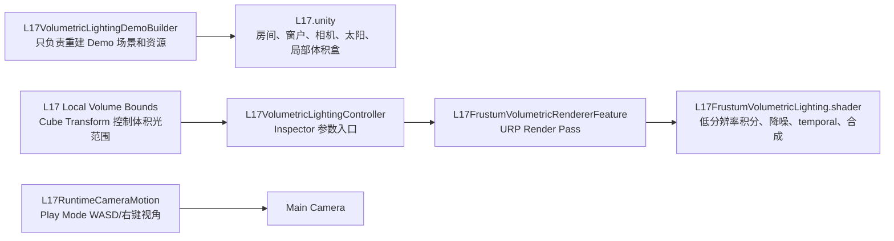

# L17 Modern Volumetric Lighting

## 目标
- 做一个现代 URP 室内窗光体积光 Demo，只保留房间整体、窗洞/窗框、主光、相机、后处理和少量室内接光物。
- 视觉重点是“阳光从窗户照进室内”的实时体积散射，不再使用手摆 cube 光束或廉价径向模糊 `god rays`。

## 算法
- RendererFeature：`L17FrustumVolumetricRendererFeature` 在 `BeforeRenderingPostProcessing` 执行。
- 体积积分：当前 Demo 回到流畅基线，默认使用半分辨率 integrated froxel buffer 和 96 depth steps，再沿相机 Z 方向累计 transmittance / in-scattering。
- 阴影约束：积分点采样 URP 主光 shadow map，并结合 sun direction，让窗框和墙体自然切出光束。
- 散射模型：参与介质由场景对象 `L17 Local Volume Bounds` 的 Transform 驱动，移动/缩放该 Cube 即可调整体积光范围；使用带生产级峰值约束的 Henyey-Greenstein 前向散射和指数高度衰减；当前密度噪声关闭，避免墙面和体积中出现程序化颗粒，并避免室外全局雾或视线接近太阳方向时出现大面积圆形光团。
- 稳定性：使用 blue-noise jitter + complementary 双相采样减少单帧步进伪影，再用 5x5 cross-bilateral 低分辨率降噪压残余颗粒；GameView 和 SceneView 都由 `temporalAccumulation` 总开关统一控制 temporal accumulation，temporal resolve 位于降噪之后，并用 3x3 neighborhood clamp 限制 history；history 重投影按 `UNITY_UV_STARTS_AT_TOP` 修正 Y 方向，避免静止镜头混入上下颠倒的历史帧。
- SceneView：编辑态 SceneView 与 GameView 共用同一个 temporal 总开关，但各自按 Camera Instance ID 维护独立 history；shader 通过 `_L17TemporalControl` uniform 分支控制，不增加 shader variant。
- 合成：integrated volume 结果经过深度约束双边滤波后合成到全屏，并在 Bloom / ACES Tonemapping 前合成。
- 运行镜头：GameView Play Mode 下由 `L17RuntimeCameraMotion` 提供手动漫游，`WASD` 移动，按住右键旋转视角，`Left/Right Shift` 加速，`Q/E` 垂直移动。

## 场景组成
- `Assets/L17 Volumetric Lighting/L17.unity`
- `Assets/L17 Volumetric Lighting/Scripts/L17FrustumVolumetricRendererFeature.cs`
- `Assets/L17 Volumetric Lighting/Scripts/L17RuntimeCameraMotion.cs`
- `Assets/L17 Volumetric Lighting/Scripts/L17VolumetricLightingController.cs`
- `Assets/L17 Volumetric Lighting/Scripts/L17LocalVolumeBoundsGizmo.cs`
- `Assets/L17 Volumetric Lighting/Shaders/L17FrustumVolumetricLighting.shader`
- `Assets/L17 Volumetric Lighting/Shaders/L17TwoSidedInteriorLit.shader`
- `Assets/L17 Volumetric Lighting/Textures/L17_BlueNoise64.asset`
- `Assets/L17 Volumetric Lighting/Materials/{L17_RoomWall,L17_DustyFloor,L17_WindowFrame}.mat`
- `Assets/L17 Volumetric Lighting/Materials/L17_PostProcessProfile.asset`
- `Assets/L17 Volumetric Lighting/Editor/L17VolumetricLightingDemoBuilder.cs`

## 代码关系

- Builder 是一次性生成工具，不再包含“整理已有层级栏”的维护菜单；当前场景层级整洁性直接保存在 `L17.unity` 中。
- Controller 是学习和调参主入口，只在启用、Inspector 修改、或局部体积盒移动/缩放时同步参数，避免每帧重复写 RendererFeature。
- RendererFeature 是真正接入 URP 的位置，负责申请 RT、调度 pass、维护每个 Camera 的 temporal history。
- Shader 是视觉算法核心，负责按深度重建世界坐标、采样主光阴影、积分体积散射、低分辨率降噪、temporal resolve 和双边上采样合成。

## 构建入口
- `Tools/Volumetric Lighting/Build L17 Modern Window Shafts Demo`

## 现阶段取舍
- 当前版本优先做“室内窗光柱”核心视觉，不额外扩展全局雾、体积云或多光源体积照明。
- 体积效果按相机屏幕低分辨率积分，性能稳定，重点展示现代 URP 自定义 RendererFeature 管线。
